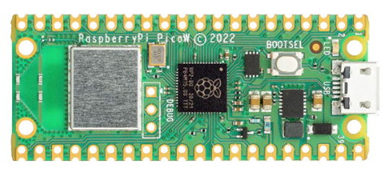
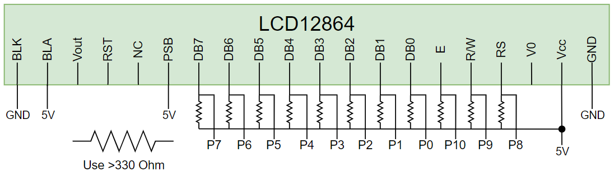
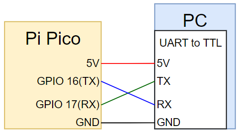

# Raspberry Pi Pico W Project Setup Document

- ## MCU Board
    - ### Raspberry Pi Pico W 
  
    
  
- ## Micropython
  - ### [Download v1.22.1](https://micropython.org/download/RPI_PICO_W/)

- ## Wiring
    - ### Connect w/ LCD (Parallel)
     Note: Because my LCD module only can use 5V signal, but pi pico output is 3.3V. Need use open-drain gpio output and add a register for each pin.
    

    - ### Connect w/ PC
    


- ## Flash python files to board
   - ### Using Pycharm with Micropython framework
   
   - ### Using Thonny - Create new script and past code. Then save into board
   

- ## Finally. Display bad apple
   ### 1. Choose python script, 5 FPS or 10 FPS frame size
   ### 2. Select board type and serial com port on your computer
    ```
    # Function by board type
    board_list = ["STM32F1", "other"]
    board_type = board_list[0]
    
    # Init Serial
    port = "COM3"
    ser = serial.Serial(port, baudrate=230400, bytesize=8, parity=serial.PARITY_NONE, stopbits=1)
    ```
   ### 3. Select progressive or interlaced mode output
   ```
      while time.time() - _tmr < 5:
        if uart.any():
            _tmr = time.time()
            uart.readinto(lcd.draw_buf, 1024)

            # print(len(_recv))
            lcd.clean()
  
            lcd.draw_frame_progressive()  # <--- This is progressive mode
            # lcd.draw_frame_interlaced() # <--- This is interlaced mode
  
            # time.sleep_ms(200)
            uart.write(b'REQ')
    print("Program stop")
   ```
   ### 4. Start python script
   ### 5. Power on your board
   ### 6. 🎉 You can see Bad apple on LCD!!! 🎉
