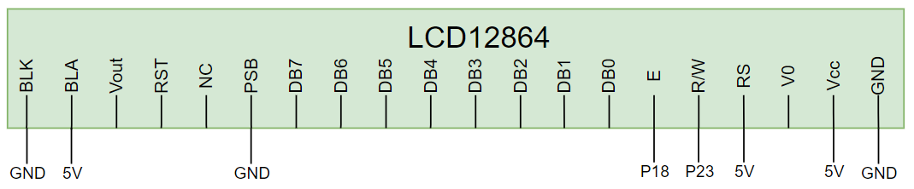

# Raspberry Pi Pico W Project Setup Document

- ## MCU Board
    - ### NodeMCU-32S - ESP32
  
    
  
- ## Micropython
  - ### Using esptool: [Download v1.22.1](https://micropython.org/download/ESP32_GENERIC/)

- ## Wiring
    - ### Connect w/ LCD
    

    - ### Connect w/ PC
    


- ## Flash python files to board
   - ### Using Pycharm with Micropython framework
   
   - ### Using Thonny - Create new script and past code. Then save into board
   

- ## Finally. Display bad apple
   ### 1. Choose python script, 5 FPS or 10 FPS frame size
   ### 2. Select board type and serial com port on your computer
    ```
    # Function by board type
    board_list = ["STM32F1", "other"]
    board_type = board_list[0]
    
    # Init Serial
    port = "COM3"
    ser = serial.Serial(port, baudrate=230400, bytesize=8, parity=serial.PARITY_NONE, stopbits=1)
    ```
   ### 3. Start python script
   ### 4. Power on your board
   ### 5. 🎉 You can see Bad apple on LCD!!! 🎉
