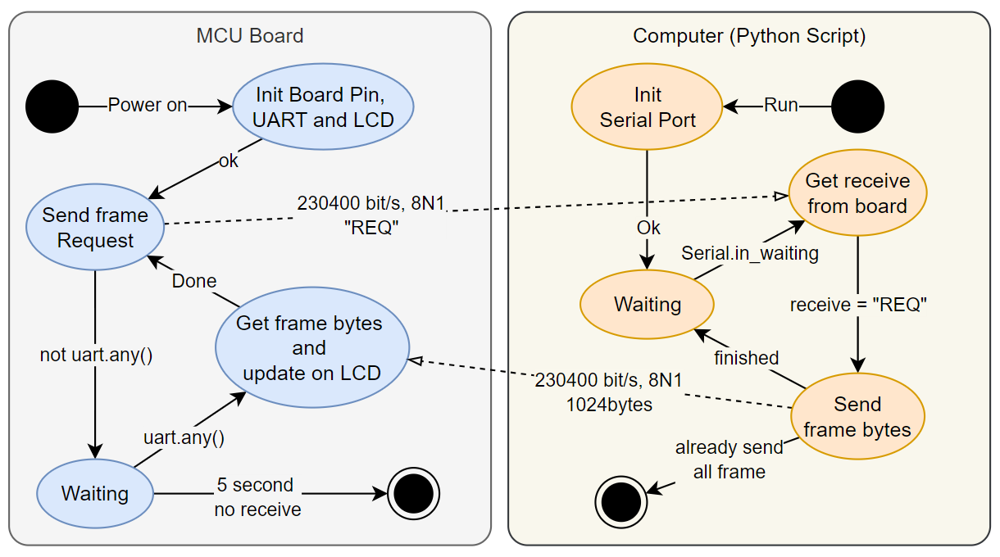

# Bad Apple on LCD12864 module
MCU Board coding practice and coding language performance comparison

- ## TL; DR

|   Board   | Code Lang.  | LCD Mode | Baud-rate |  Scan Mode  | Avg. FPS |
|:---------:|:-----------:|:--------:|:---------:|:-----------:|:--------:|
| STM32F103 | C/C++(HAL)  |   SPI    |  230400   | Progressive |   10.3   |
| STM32H753 | C/C++(HAL)  |   SPI    |  460800   | Progressive |   13.5   |
|   ESP32   | Micropython |   SPI    |  230400   | Progressive |   3.4    |
| Pi Pico W | Micropython | Parallel |  230400   | Progressive |   4.22   |
| Pi Pico W | Micropython | Parallel |  230400   | Interlaced  |   8.13   |
   - Note: LCD pixels response time is not fast enough, it has terrible image sticking.
   - The best display FPS is around ~10 FPS

- ## Resource and Tools
  - [Mindplus-Destop - LCD12864RSPI Library](https://github.com/DFRobot/Mindplus-Desktop/blob/master/resource/tools/ArduinoUploader/Arduino/libraries/LCD12864RSPI/LCD12864RSPI.cpp)
  - [Alstroemeria Records / Nomico - Bad Apple! (Image Sequence)](https://archive.org/details/bad_apple_is.7z)
  - [image2cpp](https://javl.github.io/image2cpp/)
  - [OpenOCD](https://openocd.org)
  - [GNU Arm Embedded Toolchain](https://developer.arm.com/downloads/-/gnu-rm)
  - [Using GCC with MinGW on VScode](https://code.visualstudio.com/docs/cpp/config-mingw)
  - [Micropython](https://micropython.org)
  
- ## Basic Concept:
   - **[Micropython]** Send frame bytes from PC via UART, then MCU board show result

   - **[C/C++]** Board will keep waiting PC receive. Need to push reset pin, then restart program

- ## Project setup documents
  - ### [STM32F1@Cube](STM32F1@Cube/docSTM32F1.md)
  - ### [STM32H7@Cube](STM32H7@Cube/docSTM32H7.md)
  - ### [ESP32@Micropython](ESP32@Micropython/docESP32.md)
  - ### [PiPico@Micropython](PiPico@Micropython/docPico.md)
