# STM32H7 Project Setup Document

- ## MCU Board
    - STM32 serial: **STM32H753ZI**
    - It is almost same as H743 version
      
    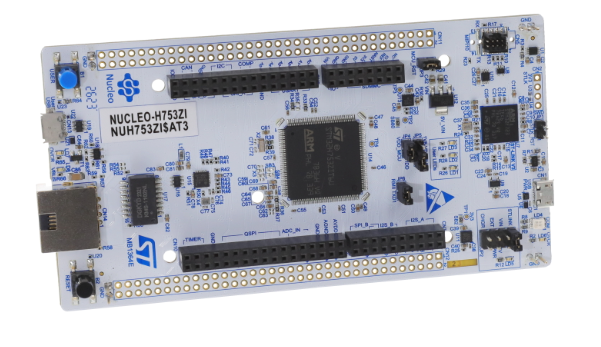
  
- ## CubeMX Setup
    - ### Select MCU by part No.
      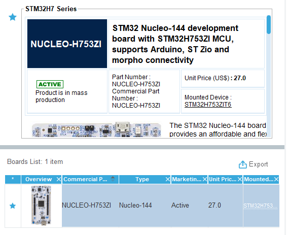 
  
    - ### Clock Tree setup
      - #### Pinout & Configuration / System Core / RCC
      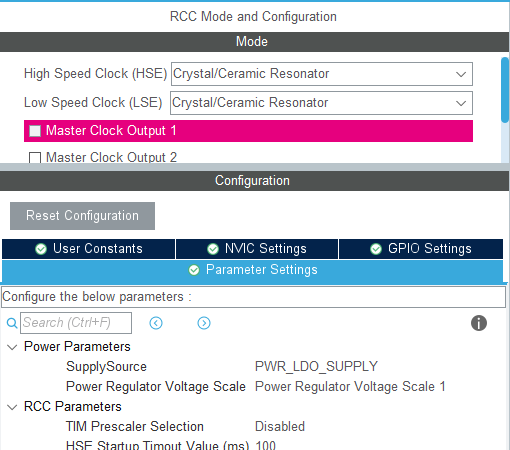 
      - #### Clock Configuration
      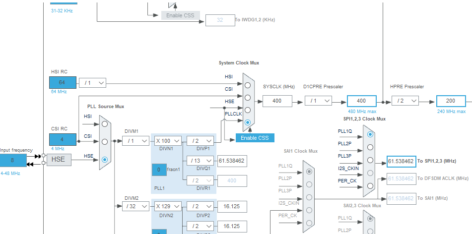
  
    - ### TIM use channel 1
      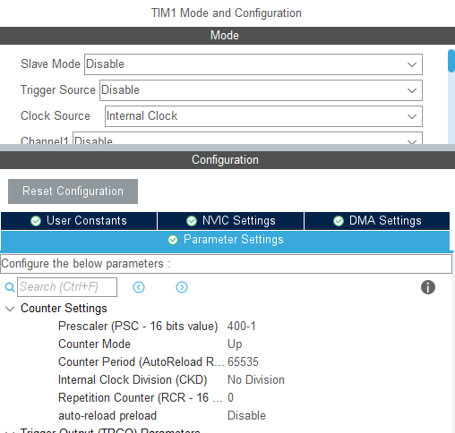 

    - ### SPI use channel 1
      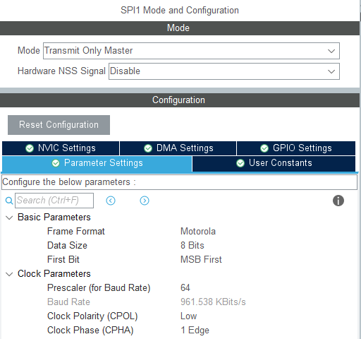
    
    - ### Setup UART pins
      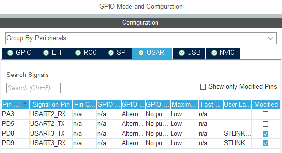
  
    - ### UART use channel 3
      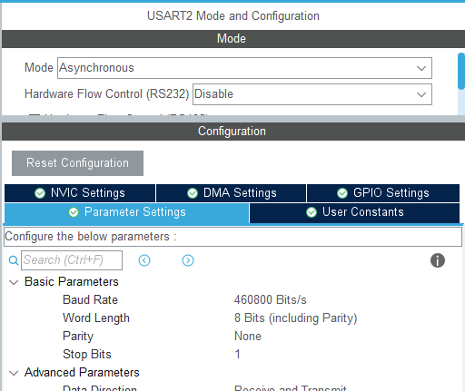
    
    - ### NVIC Setting
      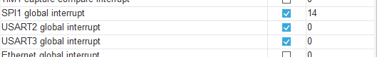

    - ### Final project setting. Use Makefile to generate project code
      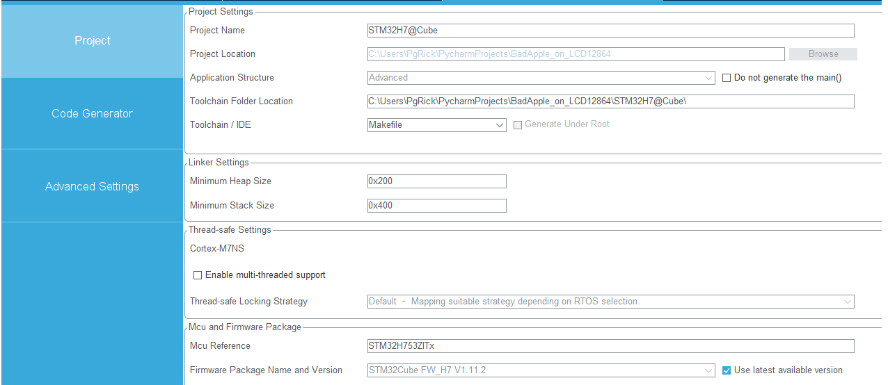

  - ## Wiring
      - ### Connect w/ LCD
      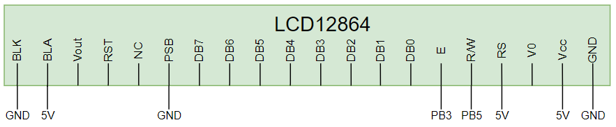

      - ### Connect w/ PC
      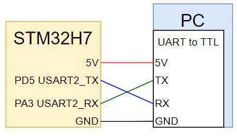

- ## Build and download to board
    - ### Make sure you have required build environment
        - [OpenOCD](https://openocd.org)
        - [GNU Arm Embedded Toolchain](https://developer.arm.com/downloads/-/gnu-rm)
        - [Using GCC with MinGW on VScode](https://code.visualstudio.com/docs/cpp/config-mingw)
    - ### Using vscode task function at vscode
    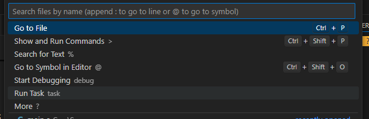
    - ### Run "build" to start build binary file. Run "download" to download to board
    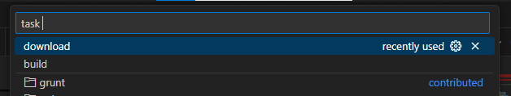
    - ### Can setting task content at .vscode/tasks.json
    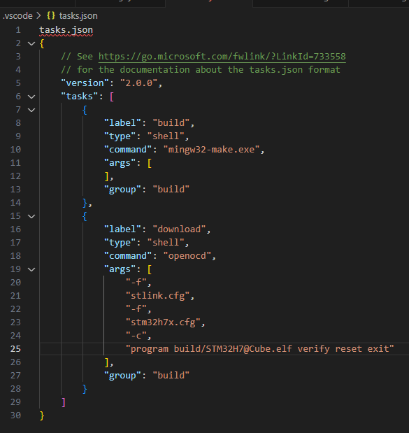

- ## Finally. Display bad apple
   ### 1. Choose python script, 5 FPS or 10 FPS frame size
   ### 2. Select board type and serial com port on your computer
    ```
    # Function by board type
    board_list = ["STM32F1", "other"]
    board_type = board_list[1]
    
    # Init Serial
    port = "COM3"
    ser = serial.Serial(port, baudrate=460800, bytesize=8, parity=serial.PARITY_NONE, stopbits=1)
    ```
   ### 3. Start python script
   ### 4. Power on your board
   ### 5. 🎉 You can see Bad apple on LCD!!! 🎉
